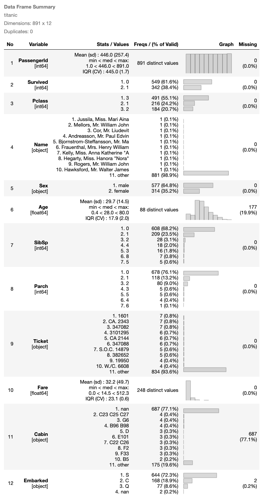

# DataFrame Summary Tools in Jupyter Notebook

This is python version of `summarytools`, which is used to generate standardized and comprehensive summary of dataframe in Jupyter Notebooks.

The idea is originated from the `summarytools` R package (https://github.com/dcomtois/summarytools).

* Only `dfSummary` function is made available for now
* Added two html widgets to avoid displaying lengthy content
    + [collapsible summary](#collapsible-summary) 
    + [tabbed summary](#tabbed-summary)

# Installation

## Install from repos
1. clone / download this repository
2. copy the `summarytools` folder to your project root directory.

## PIP Install
Special thanks to [@Buckeyes2019](https://github.com/Buckeyes2019), who wrapped this as a package and published on PyPI.
```
pip install summarytools

# take note that, the importing need to be modified in the following examples, if pip install is used.
# from summarytools import dfSummary -> from summarytools.summarytools import dfSummary
# from summarytools import tabset -> from summarytools.summarytools import tabset

```

## Dependencies
1. python 3.6+
2. packages in [requirements.txt](./requirements.txt)

# Quick Start

the quick-start notebook is available in [here](quick-start.ipynb)

out-of-box `dfSummary` function will generate a HTML based data frame summary.

```py
import pandas as pd
from summarytools import dfSummary
titanic = pd.read_csv('./data/titanic.csv')
dfSummary(titanic)
```


## collapsible summary

```py
import pandas as pd
from summarytools import dfSummary
titanic = pd.read_csv('./data/titanic.csv')
dfSummary(titanic, is_collapsible = True)
```


## tabbed summary

```py
import pandas as pd
from summarytools import dfSummary, tabset
titanic = pd.read_csv('./data/titanic.csv')
vaccine = pd.read_csv('./data/country_vaccinations.csv')
vaccine['date'] = pd.to_datetime(vaccine['date'])

tabset({
    'titanic': dfSummary(titanic).render(),
    'vaccine': dfSummary(vaccine).render()})
```


# Export notebook as HTML

when export jupyter notebook to HTML, make sure `Export Embedded HTML
` extension is installed and enabled.


Using the following bash command to retain the data frame summary in exported HTML.
```bash
jupyter nbconvert --to html_embed path/of/your/notebook.ipynb
```
